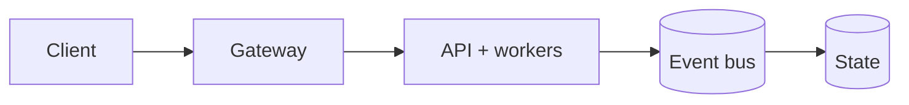

# IntelliOps-AI — Real-Time ML Monitoring Platform
[](https://github.com/CoreyLeath-code/IntelliOps-AI/actions/workflows/ci.yml)
[](https://github.com/CoreyLeath-code/IntelliOps-AI/actions/workflows/benchmarks.yml)
[](benchmarks/benchmark_report.md)
[](benchmarks/benchmark_report.md)
[](benchmarks/latest.json)
[](https://github.com/CoreyLeath-code/IntelliOps-AI/actions/workflows/security.yml)
[](https://github.com/CoreyLeath-code/IntelliOps-AI/actions/workflows/release.yml)


IntelliOps AI is a production-style Machine Learning platform engineered to simulate real-world ML infrastructure used at companies like Netflix, Google, and OpenAI.

It combines:

Real-time inference
Experiment tracking
Observability + monitoring
Scalable microservices architecture

[ METRIC SOURCES / K8S CLUSTERS ]             [ CLOUD APPLICATION RUNTIMES ]
                       │                                            │
          (Streaming Prometheus Metrics)                (High-Volume JSON Logs)
                       │                                            │
                       ▼                                            ▼
           [ INTELLIOPS AGENT MESH ]                    [ HIGH-THROUGHPUT API GATEWAY ]
          (Vector / OpenTelemetry Core)                    (Nginx Reverse Proxy Layer)
                       │                                            │
                       └──────────────────────┬─────────────────────┘
                                              │
                              (Distributed Streaming Payload)
                                              │
                                              ▼
                             [ APACHE KAFKA INGESTION BUS ]
               ┌─────────────────────────────────────────────────────────┐
               │ • Topic: 'telemetry-stream-raw' [12 Partitions]         │
               │ • High-Velocity Memory Buffer Buffer Layer              │
               └──────────────────────────────┬──────────────────────────┘
                                              │
                                (Decoupled Microservice Bus)
                                              │
                                              ▼
                             [ LOGSIGHT-AI STREAM EVALUATOR ]
               ┌─────────────────────────────────────────────────────────┐
               │ • Isolated Horizon Window Feature Store Aggregation     │
               │ • Dynamic Anomaly Isolation Vector Extraction           │
               └──────────────────────────────┬──────────────────────────┘
                                              │
                                  (Constructed Feature Vectors)
                                              │
                                              ▼
                             [ ML-DOCKER INFERENCE SERVING CORE ]
               ┌─────────────────────────────────────────────────────────┐
               │ • Quantized Sequence Scoring Models (TensorRT/ONNX)      │
               │ • Real-Time Failure Likelihood Profiling                 │
               └──────────────────────────────┬──────────────────────────┘
                                              │
                                 (Root-Cause Probability Arrays)
                                              │
                                              ▼
                              [ AUTOMATED MITIGATION DISPATCH ]
               (PagerDuty Webhooks -> AutoHealing Runbooks -> Grafana Mesh Alerts)

The system is designed to demonstrate end-to-end ML engineering capability, not just modeling.

🏗️ System Architecture
User (TypeScript Dashboard)
        ↓
Go API (Gin)
        ↓
PyTorch Model Service
        ↓
MLflow Tracking Server
        ↓
Prometheus Metrics Collection
        ↓
Grafana Visualization Dashboard
        ↓
Kubernetes Cluster (Helm Managed)
        ↓
Docker Containers
        ↓
Ansible Deployment Automation
⚙️ Tech Stack
👨‍💻 Core Languages
Go → High-performance backend API
TypeScript → Frontend dashboard
Python (PyTorch) → Machine learning models
🤖 Machine Learning
PyTorch (model training + inference)
MLflow (experiment tracking + logging)
📊 Monitoring & Observability
Prometheus (metrics collection)
Grafana (real-time dashboards)
Streamlit (interactive ML visualization)
⚙️ DevOps & Infrastructure
Docker (containerization)
Kubernetes (orchestration)
Helm (deployment templating)
Ansible (automation + provisioning)
GitHub Actions (CI/CD)
🚀 Features
✅ Real-time prediction API (Go)
✅ PyTorch model serving pipeline
✅ MLflow experiment tracking
✅ Streamlit analytics dashboard
✅ Grafana monitoring dashboards
✅ Prometheus metrics collection
✅ Dockerized microservices
✅ Kubernetes + Helm deployment
✅ Automated CI/CD pipeline
✅ Unit testing (Go + Python)

## Production Readiness Guide

> This section is the portfolio audit entry point for **IntelliOps-AI**. It describes an engineering promotion path; it is not a claim that the repository is already production-authorized.

[](https://github.com/CoreyLeath-code/IntelliOps-AI/actions) [](https://github.com/CoreyLeath-code/IntelliOps-AI/blob/main/LICENSE)

### Architecture flowchart



### Quickstart and local validation

The supported local path should be reproducible from a clean checkout. The inferred stack for this repository is **Python/platform services**.

```bash
python -m venv .venv && source .venv/bin/activate && pip install -r requirements.txt
pytest -q
```

If the project uses external services, model artifacts, cloud credentials, or private data, start them through documented local fixtures or mocks. Never place secrets or identifiable records in the repository.


| Evidence | Required record |
|---|---|
| Correctness | Test command, commit SHA, runtime, and pass/fail result |
| Performance | Warm-up, sample count, concurrency, median, p95, p99, throughput, and memory |
| Data/model quality | Dataset version, split strategy, leakage controls, calibration, subgroup results, and uncertainty |
| Runtime | Image digest, health-check latency, resource limits, and rollback target |
| Security | Dependency, secret, SAST, container, and SBOM results |

A benchmark number belongs in a versioned artifact tied to a commit and hardware/runtime description. Engineering benchmarks must not be presented as clinical, financial, safety, or model-quality validation without the appropriate domain evidence.

### Extended Q&A

**What is production-ready for this repository?**  
A reproducible build, tested public contract, controlled configuration, observable runtime, documented security boundary, versioned artifacts, and a tested rollback path.

**What must remain explicit?**  
The intended use, excluded use, data/credential handling, model or algorithm limitations, and which metrics are measured versus aspirational.

**What should be completed next?**  
Use the linked production-readiness issue for this repository as the checklist. Resolve missing tests, deployment instructions, observability, supply-chain controls, and release evidence before attaching a production claim.


The baseline below was produced by [the versioned benchmark harness](benchmarks/run_benchmark.py) in GitHub Actions. It measures the real PyTorch model service on a single CPU process; it does not include HTTP, the Go gateway, containers, network, or concurrent clients. Full protocol and limitations: [benchmark report](benchmarks/benchmark_report.md). Raw evidence: [latest JSON](benchmarks/latest.json).

### Reproducible performance baseline

| Metric | Measured value | Scope |
|---|---:|---|
| Lazy-training cold start | 6,153.593 ms | First `predict`, including 100 training epochs |
| Warm mean / median | 58.454 / 55.383 µs | 2,000 predictions after 100 warm-ups |
| Warm P95 / P99 | 79.733 / 107.213 µs | Single-sample CPU inference |
| Warm min / max | 49.943 / 167.072 µs | Observed range |
| Throughput | 15,514.45 inference/s | Sequential single-process loop |
| Peak Python allocations | 62.011 MiB | `tracemalloc` |
| Process maximum RSS | 693.352 MiB | Includes runtime and ML libraries |
| Environment | Python 3.11.15 · PyTorch 2.6.0 · Linux · 4 CPUs | GitHub-hosted runner |
| Benchmark date | 2026-07-18 | Seed `20260718` |

### Model-quality sanity check

| Metric | Value |
|---|---:|
| Accuracy | 1.000 |
| Precision | 1.000 |
| Recall | 1.000 |
| F1 | 1.000 |
| Confusion matrix | TP 50 · TN 100 · FP 0 · FN 0 |

> **Evidence boundary:** the service lazily trains on all 150 Iris rows and the sanity check evaluates those same rows. These quality values verify deterministic pipeline behavior; they are not held-out accuracy or a production generalization claim.

### Reproduce

```bash
pip install -r requirements.txt
python benchmarks/run_benchmark.py --output benchmarks/latest.json
```

CI reruns this protocol for every pull request, validates the result contract and F1 floor, publishes a job summary, and retains the raw artifact for 30 days. On comparable runners, median or P95 regressions above 15% require investigation and a documented baseline update.

🧪 Testing & Validation
Go API Tests
go test ./...
Python Model Tests
pytest
CI/CD Pipeline
Runs on every push to main
Validates:
Python model tests
Go API tests
Docker builds
⚡ Quick Start
1. Clone Repo
git clone https://github.com/CoreyLeath-code/IntelliOps-AI.git
cd intelliops-ai
2. Run Locally
docker-compose up --build
3. Access Services
API → localhost:8080
Streamlit → localhost:8501
Grafana → localhost:3000
📡 Monitoring Stack
Tool	Purpose
Prometheus	Metrics scraping
Grafana	Visualization
Streamlit	ML insights dashboard
📁 Project Structure
services/
 ├── prediction-api-go/
 ├── ml-model-pytorch/
 ├── dashboard-streamlit/
frontend/
 ├── typescript-dashboard/
infra/
 ├── k8s/
 ├── helm/
 ├── ansible/
.github/
 ├── workflows/
metrics.md
architecture.md
README.md
🧠 EXTENDED ENGINEERING Q&A (🔥 THIS IS GOLD)
❓ Why did you use Go for the backend?

Go provides:

Low latency
High concurrency (goroutines)
Strong performance for real-time APIs

This makes it ideal for ML inference services handling high throughput.

❓ Why separate Go API and PyTorch model?

This follows microservices architecture:

Go → handles requests (fast + scalable)
Python → handles ML logic (flexible + powerful)

This separation:

Improves scalability
Allows independent deployment
Mirrors real-world production systems
❓ Why MLflow?

MLflow enables:

Experiment tracking
Metric logging
Model versioning

This is critical in production ML systems where reproducibility matters.

❓ Why Kubernetes + Helm?

Kubernetes:

Handles scaling
Manages container orchestration

Helm:

Simplifies deployments
Enables reusable infrastructure templates

Together, they simulate real enterprise deployment pipelines.

❓ How does monitoring work?
Prometheus collects metrics (latency, throughput)
Grafana visualizes system health
Streamlit shows model outputs interactively

This creates full observability, which is critical in production ML.

❓ How is this different from a typical ML project?

Most ML projects:

Stop at training a model

This project:

Builds a full production pipeline
Includes:
APIs
monitoring
deployment
CI/CD

👉 This is what companies actually hire for.

❓ What scalability considerations were made?
Stateless API design
Containerized services
Horizontal scaling via Kubernetes
Load handling via Go concurrency
❓ How would you improve this further?
Add GPU inference (CUDA)
Implement A/B testing
Add model drift detection
Deploy to AWS/GCP
Add feature store (Feast)
❓ What roles does this project target?

This project aligns with:

Machine Learning Engineer (L3–L5)
AI Engineer
Backend Engineer (ML systems)
MLOps Engineer
💡 Final Note

This project demonstrates:

Systems thinking
ML engineering maturity
Production-level design

It is intentionally built to reflect real-world ML infrastructure, not just academic modeling.

⭐ If you like this project, star it!
