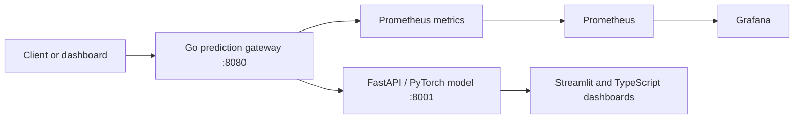

# IntelliOps-AI

[](https://github.com/CoreyLeath-code/IntelliOps-AI/actions/workflows/ci.yml)
[](https://github.com/CoreyLeath-code/IntelliOps-AI/actions/workflows/security.yml)
[](https://github.com/CoreyLeath-code/IntelliOps-AI/actions/workflows/benchmarks.yml)
[](LICENSE)

A portfolio-scale MLOps demonstration: a Go prediction gateway, a PyTorch model service, a TypeScript dashboard, and local observability components. It is designed to make service boundaries, validation, and reproducibility inspectable—not to represent an authorized production deployment.

## What is implemented

- A Go HTTP gateway that validates and forwards four-feature prediction requests.
- A FastAPI/PyTorch Iris binary-classification service with a health endpoint.
- Prometheus metrics, Grafana, and a Streamlit/TypeScript dashboard in the Compose topology.
- Docker Compose, Kubernetes/Helm, and Ansible materials for local/infrastructure experimentation.
- CI checks for Python, Go (including race tests), Compose builds, security/supply-chain workflows, and a versioned benchmark harness.

## Architecture


```mermaid
flowchart LR
    Client[Client or dashboard] --> Gateway[Go prediction gateway :8080]
    Gateway --> Model[FastAPI / PyTorch model :8001]
    Gateway --> Metrics[Prometheus metrics]
    Metrics --> Prometheus[Prometheus]
    Prometheus --> Grafana[Grafana]
    Model --> Dashboard[Streamlit and TypeScript dashboards]
```

The gateway is the public contract boundary. It accepts JSON with exactly four finite numeric features, applies a 1 MiB request-body limit, and uses a bounded downstream client. It does not return downstream error bodies to callers.

## Prediction API contract

```http
POST /predict
Content-Type: application/json

{"features": [5.1, 3.5, 1.4, 0.2]}
```

A successful response has this shape:

```json
{"prediction": 0.9, "model_version": "local-iris-binary-v1"}
```

| Condition | Status | Response behavior |
|---|---:|---|
| Wrong method | 405 | Includes `Allow: POST` |
| Malformed JSON, unknown fields, multiple JSON values, or wrong feature count | 400 | Stable validation message |
| Downstream timeout or connection failure | 503 | Stable service-unavailable message |
| Downstream error or invalid response contract | 502 | Stable bad-gateway message |

These responses are intentionally generic. Gateway logs retain operational context without copying downstream response bodies to API consumers.

## Run locally

Prerequisites: Docker Engine with the Compose plugin.

```bash
git clone https://github.com/CoreyLeath-code/IntelliOps-AI.git
cd IntelliOps-AI
docker compose up --build
```

Local endpoints:

| Component | URL |
|---|---|
| Go gateway health | http://localhost:8080/health |
| Go gateway metrics | http://localhost:8080/metrics |
| Model service health | http://localhost:8001/health |
| Grafana | http://localhost:3000 |
| TypeScript dashboard | http://localhost:3001 |
| Prometheus | http://localhost:9090 |

Example request:

```bash
curl -X POST http://localhost:8080/predict \
  -H "Content-Type: application/json" \
  -d '{"features":[5.1,3.5,1.4,0.2]}'
```

## Verify changes

The CI workflow is the source of truth for the full repository checks. Its relevant commands are:

```bash
# Python model service
python -m compileall -q services/ml-model-pytorch
ruff check services/ml-model-pytorch --select E9,F63,F7,F82
cd services/ml-model-pytorch && pytest test_model.py -v --cov=. --cov-report=term-missing

# Go gateway
cd services/prediction-api-go
gofmt -w .
go vet ./...
go test ./... -race
go build ./...

# Compose topology
docker compose config --quiet
docker compose build ml-model go-api dashboard
```

## Measured benchmark evidence

The [versioned benchmark report](benchmarks/benchmark_report.md) and [raw JSON](benchmarks/latest.json) record a seeded, single-process CPU run of the PyTorch model path on a GitHub-hosted Linux runner.

| Metric | Measured value | Scope |
|---|---:|---|
| Lazy-training cold start | 6,153.593 ms | First `predict`; includes 100 local training epochs |
| Warm median / P95 | 55.383 / 79.733 µs | 2,000 single-sample predictions after 100 warm-ups |
| Throughput | 15,514.45 inference/s | Sequential, single-process loop |
| Peak Python allocations | 62.011 MiB | `tracemalloc` |
| Process maximum RSS | 693.352 MiB | Python runtime plus ML libraries |

This is component-level evidence, not end-to-end API, container, network, concurrency, GPU, or held-out model-quality evidence. The recorded Iris quality result is explicitly a training-corpus sanity check, not a generalization claim.

Reproduce the benchmark with:

```bash
pip install -r requirements.txt
python benchmarks/run_benchmark.py --output benchmarks/latest.json
```

## Operational and security boundaries

- CI runs Python 3.10 and 3.11, Go formatting/vet/race checks, and Compose build validation.
- Repository workflows use read-only default permissions and publish test/coverage artifacts where configured.
- Prediction requests are schema constrained at the gateway; response contracts are validated before forwarding.
- Runtime configuration uses `MODEL_SERVICE_URL`; do not store credentials or service tokens in repository files.
- The included services are demonstration components. A real deployment still needs authenticated ingress, network policies, secret management, deployment-specific resource limits, and incident procedures.

## Repository layout

```text
services/
  prediction-api-go/       Go gateway and contract tests
  ml-model-pytorch/        FastAPI/PyTorch model service
frontend/dashboard-ts/     TypeScript dashboard
benchmarks/                Reproducible model-path benchmark and evidence
deploy/                    Prometheus configuration
infra/                     Kubernetes, Helm, and Ansible materials
.github/workflows/         CI, security, benchmark, and release automation
```

## Current limitations and follow-up

- The model is trained lazily for the local Iris demonstration; controlled artifact loading is preferable for a deployed system.
- The benchmark excludes gateway and network overhead; end-to-end and concurrent-load measurements remain separate work.
- Model evaluation needs a held-out, stratified protocol before any real-world quality claim.
- Production deployment requires an explicit authentication/authorization boundary and environment-specific threat model.

Tracked audit and portfolio follow-up: [#23](https://github.com/CoreyLeath-code/IntelliOps-AI/issues/23) and [#27](https://github.com/CoreyLeath-code/IntelliOps-AI/issues/27).
