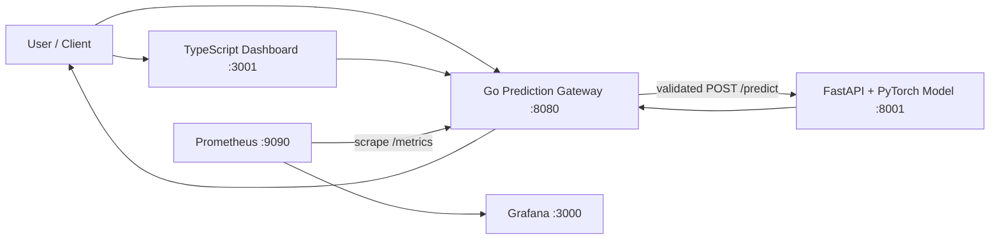
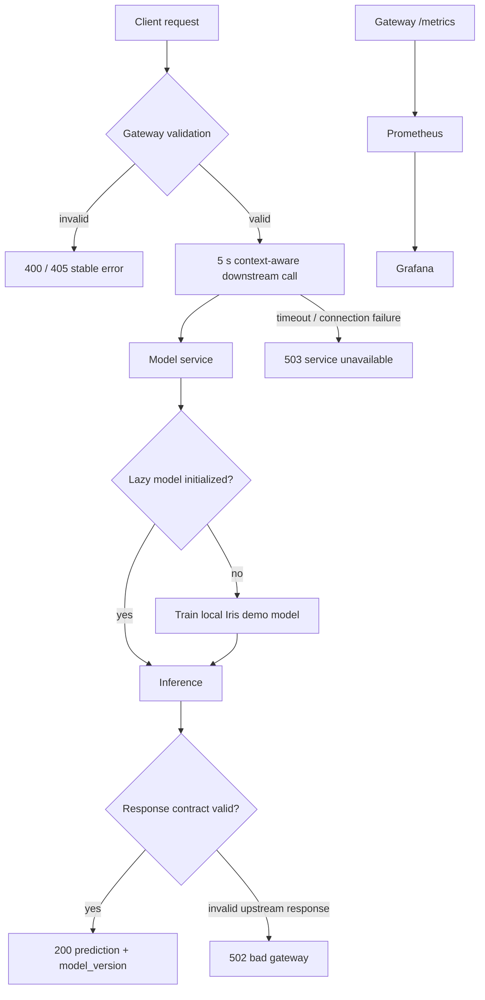

# IntelliOps-AI

[](https://github.com/CoreyLeath-code/IntelliOps-AI/actions/workflows/ci.yml)
[](https://github.com/CoreyLeath-code/IntelliOps-AI/actions/workflows/security.yml)
[](https://github.com/CoreyLeath-code/IntelliOps-AI/actions/workflows/codeql.yml)
[](https://github.com/CoreyLeath-code/IntelliOps-AI/actions/workflows/benchmarks.yml)
[](https://github.com/CoreyLeath-code/IntelliOps-AI/actions/workflows/release.yml)
[](LICENSE)

IntelliOps-AI is a portfolio-scale MLOps systems demonstration built around a Go prediction gateway, a FastAPI/PyTorch model service, a TypeScript dashboard, Prometheus/Grafana observability, containerized local orchestration, and release automation. The repository is intentionally explicit about what is measured, what is only demonstrated, and what remains necessary before a consequential production deployment.

## Engineering scope

Implemented and verifiable in this repository:

- Go HTTP prediction gateway with request validation, bounded request bodies, downstream timeouts, response-contract validation, and stable 4xx/5xx behavior.
- FastAPI/PyTorch Iris binary-classification service with health and prediction endpoints.
- TypeScript dashboard plus Prometheus and Grafana components in the local Compose topology.
- Docker Compose and deployment materials for Kubernetes/Helm and Ansible experimentation.
- Python and Go CI, Go race tests, CodeQL, dependency/security workflows, SBOM automation, reproducible benchmark evidence, and tag-triggered GitHub/GHCR release automation.

Not claimed:

- internet-scale production readiness;
- held-out model generalization quality;
- end-to-end concurrent-load performance;
- authenticated multi-tenant serving;
- GPU acceleration evidence.

## Architecture flow


```mermaid
flowchart LR
    U[User / Client] --> D[TypeScript Dashboard :3001]
    U --> G[Go Prediction Gateway :8080]
    D --> G
    G -->|validated POST /predict| M[FastAPI + PyTorch Model :8001]
    M --> G
    G --> U

    P[Prometheus :9090] -->|scrape /metrics| G
    P --> F[Grafana :3000]
```

The Go service is the public contract boundary. It accepts exactly four finite numeric features, limits request bodies to 1 MiB, uses a bounded downstream client, validates the model-service response, and does not expose arbitrary downstream error bodies to callers.

## System design flow


```mermaid
flowchart TD
    C[Client request] --> V{Gateway validation}
    V -->|invalid| E4[400 / 405 stable error]
    V -->|valid| T[5 s context-aware downstream call]
    T --> M[Model service]
    M --> L{Lazy model initialized?}
    L -->|no| TR[Train local Iris demo model]
    L -->|yes| I[Inference]
    TR --> I
    I --> R{Response contract valid?}
    R -->|yes| S[200 prediction + model_version]
    R -->|invalid upstream response| E5[502 bad gateway]
    T -->|timeout / connection failure| E6[503 service unavailable]

    GATE[Gateway /metrics] --> PROM[Prometheus]
    PROM --> GRAF[Grafana]
```

This design makes failure boundaries inspectable: malformed client input is rejected before the model call, dependency failures map to deliberate status codes, and observability is separated from the prediction response path.

## Prediction API contract

```http
POST /predict
Content-Type: application/json

{"features": [5.1, 3.5, 1.4, 0.2]}
```

Successful response shape:

```json
{"prediction": 0.9, "model_version": "local-iris-binary-v1"}
```

| Condition | Status | Behavior |
|---|---:|---|
| Wrong method | 405 | Includes `Allow: POST` |
| Malformed JSON, unknown fields, multiple JSON values, wrong feature count | 400 | Stable validation response |
| Downstream timeout or connection failure | 503 | Stable service-unavailable response |
| Downstream error or invalid response contract | 502 | Stable bad-gateway response |

## Quickstart

### Prerequisites

- Git
- Docker Engine
- Docker Compose plugin

### Start the stack

```bash
git clone https://github.com/CoreyLeath-code/IntelliOps-AI.git
cd IntelliOps-AI
docker compose up --build
```

### Verify the services

```bash
curl http://localhost:8080/health
curl http://localhost:8001/health
curl -X POST http://localhost:8080/predict \
  -H "Content-Type: application/json" \
  -d '{"features":[5.1,3.5,1.4,0.2]}'
```

Local endpoints:

| Component | URL |
|---|---|
| Go gateway health | http://localhost:8080/health |
| Go gateway metrics | http://localhost:8080/metrics |
| Model service health | http://localhost:8001/health |
| TypeScript dashboard | http://localhost:3001 |
| Prometheus | http://localhost:9090 |
| Grafana | http://localhost:3000 |

Stop the stack with:

```bash
docker compose down
```

## Reproducibility

The CI workflow is the repository source of truth for build and test verification. The equivalent local checks are:

```bash
# Python model service
python -m compileall -q services/ml-model-pytorch
ruff check services/ml-model-pytorch --select E9,F63,F7,F82
cd services/ml-model-pytorch
pytest test_model.py -v --cov=. --cov-report=term-missing
cd ../..

# Go gateway
cd services/prediction-api-go
gofmt -w .
go vet ./...
go test ./... -race
go build ./...
cd ../..

# Compose topology
docker compose config --quiet
docker compose build ml-model go-api dashboard
```

For benchmark reproduction, use the committed harness and fixed protocol:

```bash
pip install -r requirements.txt
python benchmarks/run_benchmark.py --output benchmarks/latest.json
```

The benchmark report records the seed, Python/PyTorch runtime, CPU runner scope, warm-up count, timed sample count, and memory methodology. Re-running on different hardware is expected to produce different absolute timing values.

## Research-style benchmark evidence

Source of record: [`benchmarks/benchmark_report.md`](benchmarks/benchmark_report.md) and machine-readable [`benchmarks/latest.json`](benchmarks/latest.json).

**Protocol:** fixed seed `20260718`; CPython 3.11.15; PyTorch 2.6.0+cu124 in CPU mode; GitHub-hosted Linux runner reporting 4 CPUs; 100 warm-up predictions followed by 2,000 timed single-sample predictions. The model is trained lazily for 100 epochs on the local Iris demonstration path.

| Metric | Measured value | Interpretation |
|---|---:|---|
| Lazy-training cold start | 6,153.593 ms | First prediction includes model training |
| Warm mean latency | 58.454 µs | Isolated model-path execution |
| Warm median latency | 55.383 µs | Isolated model-path execution |
| Warm P95 latency | 79.733 µs | Isolated model-path execution |
| Warm P99 latency | 107.213 µs | Isolated model-path execution |
| Warm throughput | 15,514.45 inference/s | Sequential, single-process loop |
| Peak Python traced allocations | 62.011 MiB | `tracemalloc` |
| Process maximum RSS | 693.352 MiB | Python runtime + imported ML libraries |
| Accuracy / precision / recall / F1 | 1.000 / 1.000 / 1.000 / 1.000 | Training-corpus sanity check only |
| Confusion matrix | TP 50 · TN 100 · FP 0 · FN 0 | Same-corpus evaluation |

### How to read these numbers

The latency and throughput measurements exclude HTTP serialization, Go gateway overhead, containers, network transport, concurrent clients, and GPU execution. The perfect classification scores are **not** held-out evaluation: the service trains and evaluates on the same Iris rows, so these numbers verify deterministic pipeline behavior rather than generalization.

The largest demonstrated performance issue is cold-start behavior. Moving training out of the request path and loading a versioned model artifact during controlled startup is the highest-value architectural improvement before treating this as a deployable model-serving pattern.

## Release and supply-chain contract

Tags matching `v*.*.*` trigger `.github/workflows/release.yml`. The workflow:

1. checks out the tagged source;
2. builds a versioned source archive;
3. publishes a GitHub Release using generated release notes;
4. authenticates to GHCR with the GitHub token; and
5. builds and pushes versioned images for `ml-model`, `prediction-api`, and `dashboard`.

Release publication is therefore tag-driven. CI/security/benchmark workflows remain separate evidence and should be green before a release tag is cut.

### What is strong

- The gateway now owns input/output contracts instead of treating the model service as trusted input.
- Tests include race-enabled Go execution and failure-path behavior rather than only happy-path unit tests.
- Benchmark claims are scoped and accompanied by a machine-readable artifact and explicit experimental protocol.
- Release automation produces both a source artifact and service images.
- The README avoids calling the system production-ready without the controls required to support that claim.

### Highest-priority gaps

1. **Model lifecycle:** replace request-path training with a versioned immutable model artifact, startup validation, and explicit promotion/rollback semantics.
2. **Evaluation quality:** add a held-out stratified evaluation and confidence intervals before making model-quality claims.
3. **End-to-end performance:** benchmark gateway + model + serialization under controlled concurrency at 1/10/100 clients.
4. **Runtime resilience:** add readiness semantics, dependency-health behavior, resource limits, and controlled shutdown testing.
5. **Security boundary:** add authenticated ingress, authorization policy, secret management, and environment-specific threat modeling before internet-facing deployment.
6. **Release provenance:** extend the release workflow with checksums/provenance signatures and attach the SBOM to the same immutable release contract.

These gaps are engineering work items, not hidden assumptions.

## Repository layout

```text
services/
  prediction-api-go/       Go gateway and contract/failure-path tests
  ml-model-pytorch/        FastAPI/PyTorch model service
frontend/dashboard-ts/     TypeScript dashboard
benchmarks/                Benchmark harness, report, and raw evidence
deploy/                    Prometheus configuration and deployment materials
infra/                     Kubernetes, Helm, and Ansible materials
.github/workflows/         CI, security, CodeQL, benchmark, and release automation
```

## Q&A

### Is IntelliOps-AI production-ready?
No. It is a deliberately inspectable portfolio-scale MLOps systems demonstration. Production use would require stronger authentication, secret management, environment-specific resource controls, model artifact promotion, rollback procedures, and deployment-specific operational validation.

### Why use a Go gateway in front of FastAPI?
The separation makes the external API contract independent of model implementation details. The Go boundary performs request validation, body limits, timeout handling, response validation, and deliberate error translation before or after calling the Python model service.

### Why is the first prediction much slower?
The current model path trains lazily. The measured first prediction is about 6.15 seconds because it includes 100 training epochs. Warm predictions are much faster because model initialization has already happened.

### Does the 1.000 F1 score mean the model is perfect?
No. The benchmark evaluates the same Iris corpus used for training. It is a deterministic sanity check, not a held-out generalization result.

### Are the throughput results end-to-end API numbers?
No. The reported throughput is an isolated, sequential, single-process model-path benchmark. It excludes the gateway, HTTP, network, container, concurrency, and dashboard overhead.

### What happens when the model service fails?
The gateway maps timeout/connection failures to 503 and invalid or unsuccessful downstream responses to 502, keeping client-visible errors stable rather than leaking arbitrary dependency responses.

### How are releases published?
Push a semantic-version tag matching `v*.*.*`. The release workflow creates a source archive, publishes a GitHub Release, and pushes three service images to GHCR.

### What should be built next?
The next highest-value work is immutable model artifact loading, held-out evaluation, end-to-end concurrent-load benchmarks, stronger runtime readiness/resource controls, and release provenance/signing.

## Current limitations

- Model training occurs lazily in the local demonstration path.
- No held-out model-quality evaluation is currently claimed.
- Recorded benchmarks are component-level, not end-to-end or concurrent-load evidence.
- Production authentication/authorization and environment-specific threat modeling are not implemented.
- Deployment manifests are experimentation materials, not evidence of a live production environment.

Tracked follow-up: [#23](https://github.com/CoreyLeath-code/IntelliOps-AI/issues/23) and [#27](https://github.com/CoreyLeath-code/IntelliOps-AI/issues/27).

## License

See [LICENSE](LICENSE).
