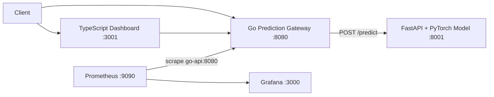
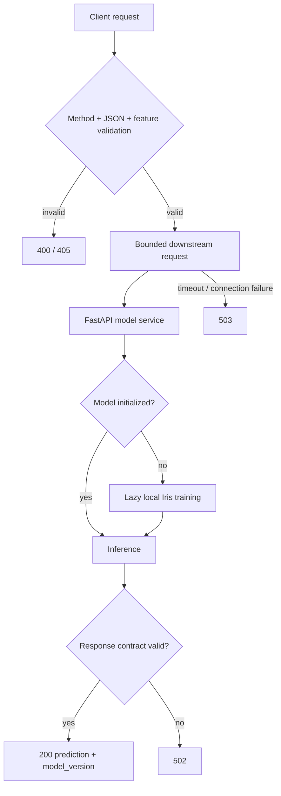

# IntelliOps-AI Architecture

This document describes only components and boundaries that are represented in the repository. It should not be interpreted as evidence of a live production deployment.

## Runtime topology

## Request and failure path

## Responsibility boundaries

| Component | Primary responsibility | Explicit boundary |
|---|---|---|
| TypeScript dashboard | Human-facing local UI | Does not define model correctness or authorization |
| Go gateway | External request contract, validation, timeout/error translation, metrics | Does not trust arbitrary downstream responses |
| FastAPI/PyTorch service | Local demonstration model inference | Current model is lazily trained; no held-out quality claim |
| Prometheus | Scrapes gateway metrics | Observability plane, not part of prediction correctness |
| Grafana | Visualizes collected telemetry | Dashboard presence is not production monitoring evidence |
| Docker Compose | Local service orchestration | Local demonstration topology, not production deployment evidence |
| Kubernetes/Helm/Ansible materials | Infrastructure experimentation | Presence of manifests does not prove a live cluster |

## Architectural trade-offs

The Go/Python service split adds a network boundary and deployment complexity, but it cleanly separates the stable public API contract from model implementation details. The largest current model-serving weakness is request-path lazy training: it simplifies a demonstration but makes cold-start latency large and weakens artifact promotion/rollback semantics. A stronger design would train offline, publish an immutable versioned artifact, validate it at startup, and expose readiness only after successful loading.

## Evidence boundaries

The committed benchmark measures the isolated PyTorch model path after warm-up. It does not measure HTTP, gateway, container, network, concurrent-client, or GPU performance. The reported classification score is computed on the same Iris corpus used for training and is therefore a deterministic sanity check rather than a generalization result.
